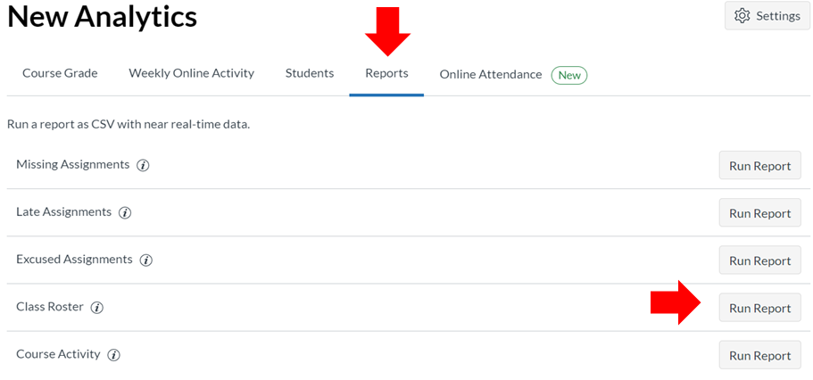
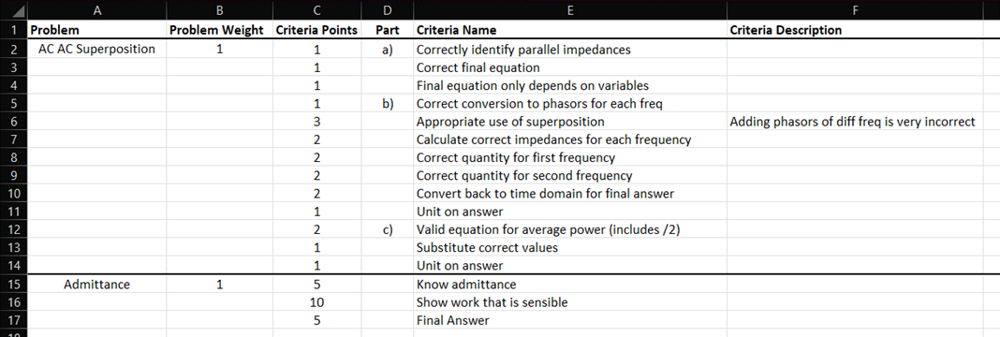
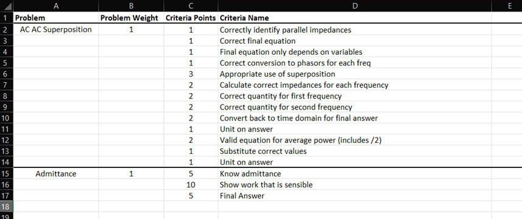
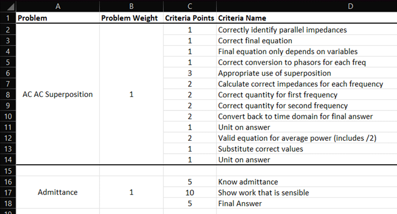
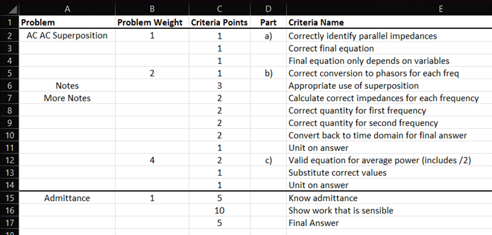

# Usage Handbook

This guide shows how to create new projects, create and import rubrics, and import class lists.

## Preparing Class Lists for DEXTER

The first step is to source a class list. There are three methods to creating a class list: Import from Canvas, Import from myMSOE, or manually.

### Importing from Canvas LMS

1. Navigate to your Canvas course’s **Home page**.
2. On the rightmost side of the window, click the **New Analytics** button. 

    <picture>
        <source media="(prefers-color-scheme: dark)" srcset="images/importCanvas1.png">
        <source media="(prefers-color-scheme: light)" srcset="images/importCanvas1.png">
        
    </picture>

3. In **New Analytics**, click on the **Reports** tab. Then click **Run Report** for the Class Roster.

    <picture>
        <source media="(prefers-color-scheme: dark)" srcset="images/importCanvas2.png">
        <source media="(prefers-color-scheme: light)" srcset="images/importCanvas2.png">
        
    </picture>

4. A `.csv` file should be downloaded. The default name is likely not ideal. Consider renaming the .csv file. You can store this anywhere on your computer but remember where you put it. When you create a new DEXTER project, you will select this file via your file explorer.

### Manual Student List

>[!NOTE]
>Not yet implemented

## Designing Rubrics

Rubrics for DEXTER are designed in Microsoft Excel and maintained as `.xlsx` files. Once the Rubric is loaded into DEXTER, it cannot be changed (see developer for assistance – changing rubrics is a future feature).

### Spreadsheet Format

Only one sheet should exist in an Excel file – DEXTER will only read the first sheet in the file.

Rubrics require the first row of the spreadsheet to contain the following columns (with EXACT spelling and capitalization). These columns can be in any order.

Each row contains a criterion. Completely empty rows are also acceptable. A criterion row with a Problem and Problem Weight entry defines a new problem.

| **Column Name**          | **Required** | **(Data Type) Description**                                                                                                                                                                                                                                                                    |
|--------------------------|--------------|------------------------------------------------------------------------------------------------------------------------------------------------------------------------------------------------------------------------------------------------------------------------------------------------|
| **Problem**              | Yes          | (string) The name of the problem.                                                                                                                                                                                                                                                              |
| **Problem Weight**       | Yes          | (numeric) The relative weighting of the problem. DEXTER will normalize your weights such that they total 1 (100%).                                                                                                                                                                             |
| **Criteria Points**      | Yes          | (numeric) The number of points to allocate to each criterion. The sum of criteria within a problem makes up the total points of the problem. The percentage of correct points is computed, then multiplied by the Problem Weight to yield the problem's total contribution to the total grade. |
| **Part**                 | No           | (string) If a criterion belongs to a group of criteria. Does not impact scoring. This is purely cosmetic to help grade faster.                                                                                                                                                                 |
| **Criteria Name**        | Yes          | (string) The primary description of the criterion. This is shown on the app and in the grade printout to students.                                                                                                                                                                             |
| **Criteria Description** | No           | (string) A more detailed description of the criterion. Consider including more detailed solutions or grading guides. The description is not available on grade printouts - only the instructor can see them when hovering their mouse over the criterion description text.                     |

### Example Rubrics

Example `.xlsx` files can be found in the examples folder but several examples are explained below.

#### Example 1: Standard Format

Below is a typical rubric format with all columns. This rubric has two problems: “AC AC Superposition” and “Admittance”; each are weighted (1) which will be normalized to 0.5 (50% of total grade). The empty space below the Problem name indicates that the criteria to the right all belong to that problem. The first problem has many criteria which have been cosmetically organized into three parts (a, b, and c). One of the criterion in the first problem has an extra note to remind the grader of what to look for in that problem.

    <picture>
        
    </picture>

#### Example 2: Trimmed Example (only required columns)

Here is an example without the optional Part and Criteria Description columns.

    <picture>
        
    </picture>

#### Example 3: Cosmetic Tables

In this example, the empty rows beneath the Problem and Problem Weight header can be merged. Empty rows are also acceptable [row 15].

    <picture>
        
    </picture>

#### Bad Example!

Below are some ways NOT to format the rubric. In this example, there are two violations:
1. Do not put any notes or text between Problem names [cell A6 and A7], DEXTER will think those are unique problems. Consider moving notes to the Criteria Description column.
2. Do not configure multiple weights per problem [cell B5 and B12], use the Criteria Points column to handle within-problem weighting (or consider breaking the problem into three separate problems).

    <picture>
        
    </picture>

