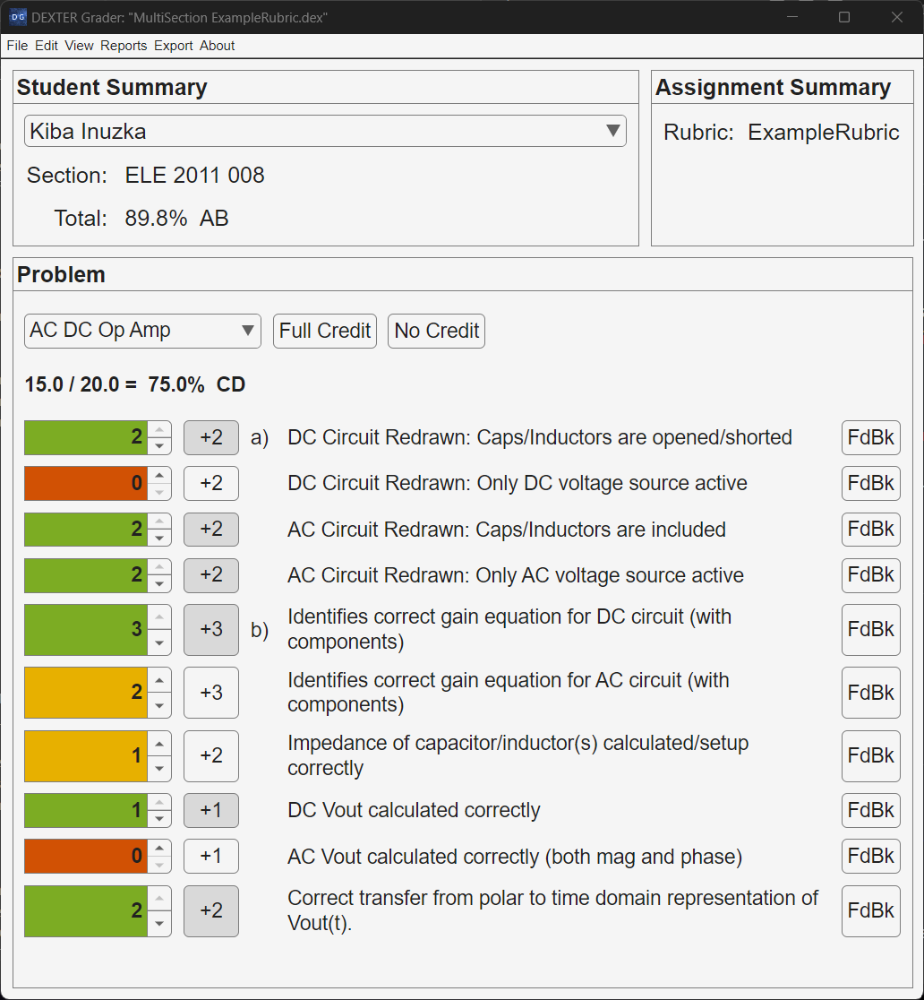

# DEXTER Grader

DEXTER Grader (DEXTER) is a grading calculator and gradebook manager. DEXTER’s main goal is to improve the efficiency and consistency of grading. The secondary goal of DEXTER is to provide insights into student performance. 

This is not a unified gradebook. DEXTER acts on individual assignments/exams; you will need a new DEXTER project per assignment. Projects are initialized using a class list and rubric file. See the [User Guide](docs/usage.md) on how to find, create, or format these files.

DEXTER is currently only supported on Windows OS.

<p align="center">
    <picture>
        
    </picture>
</p>

## Bug Reporting and Feature Requests

- [Click here to report a bug](https://github.com/DevonLantagne/DEXTER-Grader/issues/new?template=bug_report.yml)
- [Click here to request a new feature](https://github.com/DevonLantagne/DEXTER-Grader/issues/new?template=feature_request.yml)

## Installation

There are two ways to run DEXTER Grader: as a standalone MATLAB package using the MATLAB Runtime; or directly in MATLAB. Both methods are described below.

> [!IMPORTANT]
> DEXTER Grader is only supported on Windows OS. If you are a MacOS user, please open a feature request for the OS support.

### Standalone + MATLAB Runtime

DEXTER is packaged as a "standalone" MATLAB App. To use a standalone MATLAB app, you need the MATLAB Runtime (not full MATLAB or license). When you install DEXTER, the runtime will also be installed if it is not already on your computer. 

Visit the [Releases](https://github.com/DevonLantagne/DEXTER-Grader/releases) pages for all versions. Scroll to the bottom of a release to Assets and download the installer. This will also install dependencies such as the MATLAB Runtime.

### MATLAB Source

If you already have MATLAB on your system, you can clone or download this repository and add the `/src` directory to your MATLAB path. This will allow you to call the DEXTER app from the command window:
```matlab
>> DEXTER
```

> [!NOTE]
> This repository is also compatible with VS Code and the MATLAB extension if you would rather use the MATLAB engine through a different editor.
>
> When this repo is opened in VS Code, it will recommend extensions for this repo (including the MATLAB extension). You can then open a MATLAB terminal in VS Code and run `DEXTER`.
>
> MATLAB will see the `startup.m` script and execute it when the workspace is opened (which adds this repo to your path temporarily). You may have to close and reopen the MATLAB terminal for the `startup.m` to take effect, otherwise you can run the script manually by typing `startup` in the MATLAB terminal.

## Documentation

Vist the [documentation page](docs/usage.md) for getting started and exploring DEXTER features.

## Features

### Import Rubrics and Student Lists

- **Rubric Import:** Import a grading rubric in Microsoft Excel format. The rubric should contain grading criteria for each problem in the assignment. See the provided examples.
- **Student List Import:** Import a list of student names, typically from Canvas LMS or any other CSV-compatible source. This will create a list of students for easy navigation and grading.

> [!NOTE]
> Canvas integration coming soon!

### Grading Interface

- **Sequential Grading Scheme:** Navigate through your students as you grade one problem before switching to the next, or grade all problems within one student.
- **One problem is displayed at a time**, with its associated grading criteria. Graders can quickly assess each student's work using the rubric.
- **Grading Criteria:** Your Excel rubric dictates grading criteria and point allotment. Quickly select full or no credit and have the option to enter partial credit. You can also set weights for each problem. Grades are calculated automatically.
- **Grading Scale:** Maps numeric scores to a letter grading scale. Default is the Milwaukee School of Engineering. Can be reconfigured.

### Navigation

- Change problems or students using button controls or via customizable keyboard shortcuts.
- Can sort students based on last or first name.

### Project Mangement

- Each assignment is its own project file that is stored on your computer.
- Includes an optional autosave feature that saves after every changing to a new problem or student.

### Reporting

- Export rubric printouts for each student as `.txt` or `.pdf` files.
> [!NOTE]
> Canvas integration coming soon! Will be able to automatically send grade and report printout as a feedback attachment.
- View insights into student performance with aggregate reports for each problem.
